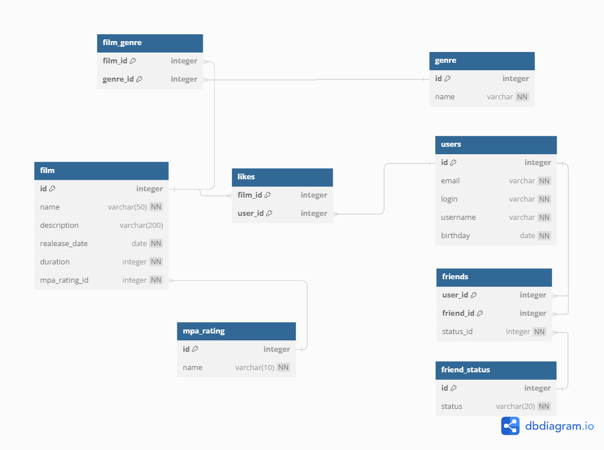

# java-filmorate
Template repository for Filmorate project.


********************************************************************************
## USER
*******************************************************************************
+ **User addUser(User user);**
```
INSERT INTO users(email,login,username,birthday)
VALUES ('sss@sdss.ru','ivan1990','Ivan Kusznetsov','1990-4-3')
```
+ **User updateUser(User user);**
```
UPDATE users
SET email='new@email', login='newlogin',username='newUsername',birthday='999-09-09'
WHERE id=1
```
+ **Collection<User> getAllUsers();**
```
SELECT *
FROM users
```
+ **boolean containsUser(User user);**
```
SELECT 1
FROM users
WHERE email='s' AND login='' AND username='' AND birthday=''
```
+ **boolean containsId(int id);**
```
SELECT 1
FROM users
WHERE id=2221
```
+ **void addFriend(Integer offerId, Integer acceptId);**
```
INSERT INTO friends
VALUES (offerId,acceptId);,'confirmed'), (acceptId,offerId,'confirmed')
```
+ **void deleteFriend(Integer offerId, Integer toDeleteId);**
```
DELETE from friends
WHERE user_id=offerId,  AND friend_id=toDeleteId);; 
DELETE from friends
WHERE user_id=toDeleteId); AND friend_id=offerId, ; 
```
+ **Collection<User> getAllFriends(Integer userId);**
```
SELECT *
FROM users
WHERE id IN (
SELECT friend_id
FROM friends
WHERE user_id=userId AND status='confirmed')
```
+ **Collection<User> getMutualFriends(Integer id, Integer otherId);**
```
SELECT *
FROM users
WHERE id IN(
(SELECT friend_id
FROM friends
WHERE user_id=id AND status='confirmed')
INTERSECT
(SELECT friend_id
FROM friends
WHERE user_id=otherId AND status='confirmed')
)
```
********************************************************************************
## FILM
********************************************************************************
+ **Film addFilm(Film film);**
```INSERT INTO film(name,description, realease_date,duration,rating_id)
VALUES ('Иван Васильевич меняет профессию','известный советский фильм Гайдая','1970-10-1',120,1);
```
+ **Film updateFilm(Film film);**
```
UPDATE film
SET name='newname',description='newdescription',realease_date='222-2-2', duration=333,rating_id=2
WHERE id=1
```
+ **Collection<Film> getAllFilms();**
```
SELECT *
FROM Films
```
+ **boolean containsFilm(Film film);**
```
SELECT 1
FROM film
WHERE name='newname',realease_date='222-2-2', duration=333
```
+ **boolean containsId(int id);**
```
SELECT 1
FROM film
WHERE id=2221
```
+ **boolean addUserLikeToFilm(Integer filmId, Integer userId);**
```
INSERT INTO likes
VALUES (2,3);
```
+ **boolean deleteUserLikeFromFilm(Integer filmId, Integer userId);**
```
DELETE FROM likes
WHERE film_id=1 AND user_id=2;
```
+ **Collection<Film> getMostPopularFilms(int count);**
```
SELECT COUNT(user_id) AS counts
FROM likes
GROUP BY film_id
ORDER BY counts DESC
```
+ **int getFilmLikes(Integer filmId);**
```
SELECT COUNT(user_id)
FROM likes
WHERE film_id=2
GROUP BY film_id;
```